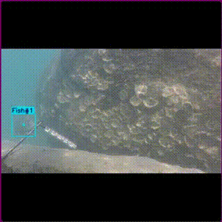

# Fish Detection and Counting using YOLOv8 models and color correction techniques for NGOs

- Dionisius Mayr 2218364
- Hetvi Chaniyara 1840932
- Linhan Wang 2215322
- Min Zhang 2215187
- Tejada Gian 2215284
- Ziyong Zhang 1921770

# Environment and reproducibility

All the experiments here were executed under Python 3.11.2 and using the package versions specified in `requirements.txt` and `seed == 0`.
It is strongly advised to create a new virtual enviroment to execute this code (i.e. `python3 -m virtualenv venv'`).

# Folder and file structure

Basically the project follows a folder hierarchy that is compatbile with the one used by YOLO:
```
.
├── datasets
│   ├── fish4knowledge
│   ├── images
│   ├── images_preprocessed
│   ├── labels
│   └── videos
├── data.yaml
├── deep_fish.ipynb
├── output_video
├── README.md
├── requirements.txt
└── runs
```

- `dataset` is an important folder containing both the base images, the `images_preprocessed` that are generated by the preprocessing script (located inside the jupyter notebook), the `labels` of every image and the generated `videos` as well. For the sake of making the model easier to reproduce, we are also sharing the same `fish4knowledge` dataset that was used to measure the generalization of our methods.
- `data.yaml` is a configuration file used by YOLO to specify the paths of the images;
- `deep_fish.ipynb` is the jupyter notebook containing all the code used.
- `output_video` contains a sample of the model being applied in a test video;
- `requirements.txt` contains the exact package versions used to run these experiments;
- `runs` contains the result of each model, including the `weights`, performance metrics, execution sample and more information. The weights can be used directly, without needing to train the models again.

# Execution example



